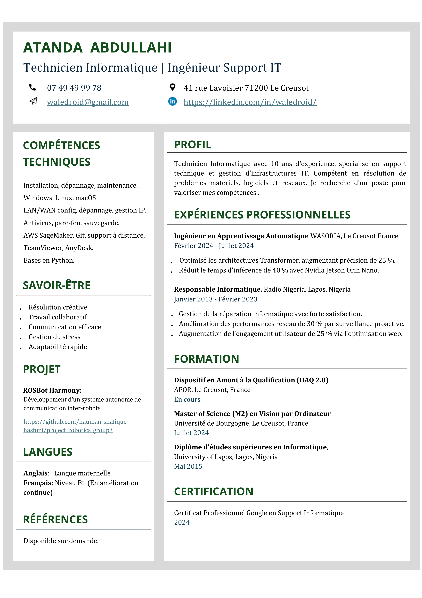

# Abdullahi Atanda | Technicien Informatique & Ingénieur Support

👋 Bonjour ! Je suis Abdullahi Atanda, un technicien informatique avec plus de 10 ans d'expérience dans le support technique, la gestion des infrastructures IT et l'automatisation. Je suis passionné par la résolution de problèmes techniques complexes, l'amélioration des performances réseau et la fourniture d'un support de qualité aux utilisateurs et aux entreprises.

## Compétences
- **Expertise technique** : Windows, Linux, macOS, configuration LAN/WAN, gestion IP, dépannage.
- **Sécurité & Maintenance** : Antivirus, pare-feu, sauvegardes.
- **Cloud & DevOps** : AWS SageMaker, Git, support à distance (TeamViewer, AnyDesk).
- **Programmation** : Python (bases).
- **Langues** : Anglais (courant), Français (B1 - en amélioration).

## Projets Notables
- **ROSBot Harmony** : Développement d'un système de communication autonome entre robots.
  - [Lien GitHub](https://github.com/nauman-shafique-hashmi/project_robotics_group3)

## Expériences Professionnelles
- **Ingénieur en Apprentissage Automatique, WASORIA** | Février 2024 – Juillet 2024
  - Optimisation des modèles Transformer, augmentant la précision de 25%.
  - Réduction du temps d'inférence de 40% avec Nvidia Jetson Orin Nano.
  
- **Responsable Informatique, Radio Nigeria** | Janvier 2013 – Février 2023
  - Amélioration des performances réseau de 30%.
  - Augmentation de l'engagement des utilisateurs de 25% grâce à l'optimisation du site web.

## Formation & Certifications
- **Master en Vision par Ordinateur** | Université de Bourgogne, France (2024)
- **Certificat Professionnel en Support Informatique** | Google (2024)

---

### Mon CV :

Cliquez sur l'image pour consulter le PDF complet.

---

N'hésitez pas à explorer mes projets et à me contacter sur [LinkedIn](https://linkedin.com/in/waledroid).
